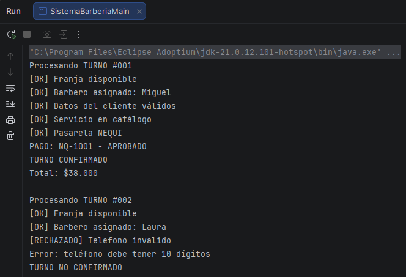
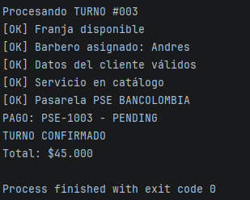

# DOSW_Parcial_T1

Carlos Andres Sanchez Jimenez
DOSW 2026-2 Grupo 1
URL BITACORA: https://github.com/Carlossj8/DOSW_BITACORA.git

## Punto 1) diagrama de contexto

## Punto 2) requerimientos

### Funcionales (3)
- Realizar pago del servicio (Uso de Adapter)
- Validar y asignar turno según disponibilidad y especialidad (Uso de Chain of Responsibility)
- Notificar motivo de rechazo de una validación

### No Funcionales (2)
- Estar disponible con un porcentaje de 99.5% en horario de operación de lunes a domingo
- El sistema debe procesar un turno en $\le \text{2 s}$ para el 95% de las solicitudes.

## Punto 3) diagrama de casos de uso

Como cliente,quiero realizar el pago de mi turno usando diferentes medios, para cancelar el valor del servicio según mi comodidad y preferencia.

Como cliente quiero Ser informado del motivo especifico de rechazo cuando una validacion falla
para poder corregir dicha información al solicitar nuevamente el servicio

## Punto 4)

"Carpeta requirements"

## Punto 5)

### Épica
Sistema de procesamiento y normalización de pagos multicanal para Bob's Barber

### Feature
Integración de pasarelas de pago heterogéneas mediante adaptadores normalizados

### Historia de Usuario
Como cliente quiero realizar el pago de mi turno mediante Nequi, PSE, Stripe o Efectivo para confirmar mi reserva según mi método de pago de preferencia.

### Tareas
* Definir la interfaz común de pago y el modelo unificado de respuesta con los campos payment_Id, estado y mensaje.
* Implementar los adaptadores para Nequi, PSE, Stripe y Efectivo aplicando las reglas de simulación de cada proveedor.
* Desarrollar el servicio que recibe la solicitud de pago del turno y la delega al adaptador correspondiente.

## Punto 6: Patrones de Diseño

### Chain of Responsibility
* Tipo: Comportamiento
* Justificación: Es útil porque cada turno debe pasar por una serie de 5 validaciones obligatorias y ordenadas antes de confirmarse. Si alguna falla, detiene el proceso de inmediato sin acoplar las validaciones entre sí.
* SOLID aplicados:
  * Open/Closed Principle: Permite agregar nuevos pasos de validación creando nuevos manejadores sin modificar el flujo principal del sistema.
  * Single Responsibility Principle: Cada clase validadora se encarga únicamente de revisar una regla específica del turno.
  * Dependency Inversion Principle: Los manejadores y el cliente dependen de una abstracción base y no de las validaciones concretas.

### Adapter
* Tipo: Estructural
* Justificación: Es útil porque las cuatro pasarelas de pago tienen métodos y respuestas totalmente incompatibles entre sí. El adaptador actúa como traductor para unificar todas las respuestas a un formato común (payment_Id, estado, mensaje).
* SOLID aplicados:
  * Open/Closed Principle: Se pueden integrar nuevas pasarelas de pago agregando un nuevo adaptador sin alterar el código existente del sistema.
  * Single Responsibility Principle: Separa la lógica de conversión y comunicación externa de la lógica de negocio principal de la barbería.
  * Dependency Inversion Principle: La barbería depende de una interfaz general de procesamiento de pagos y no de las librerías o implementaciones directas de cada pasarela.

## Evidencias ejecucion codigo

-----------------------------------------

## Prerrequisitos

