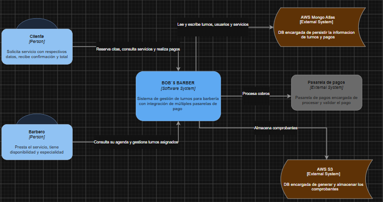
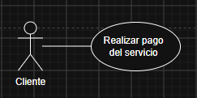
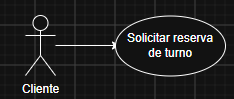
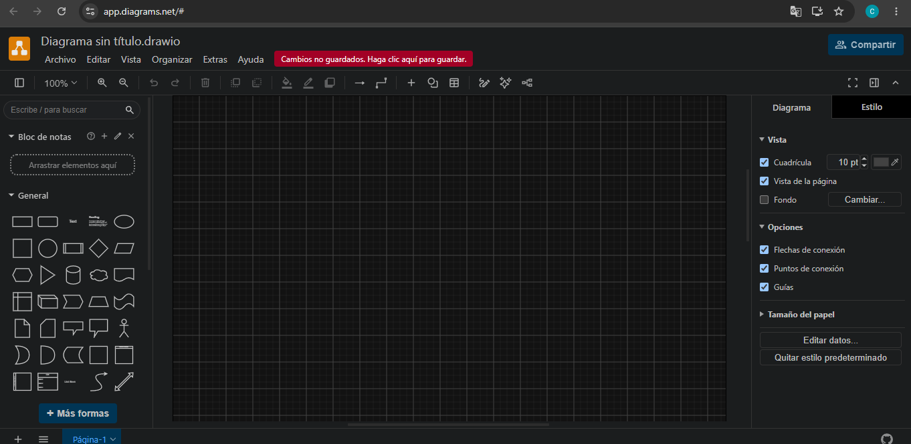
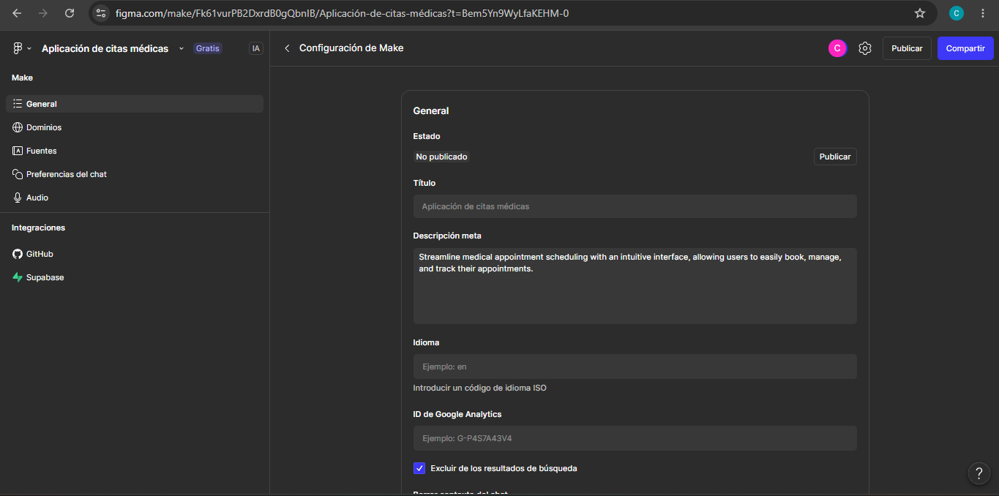
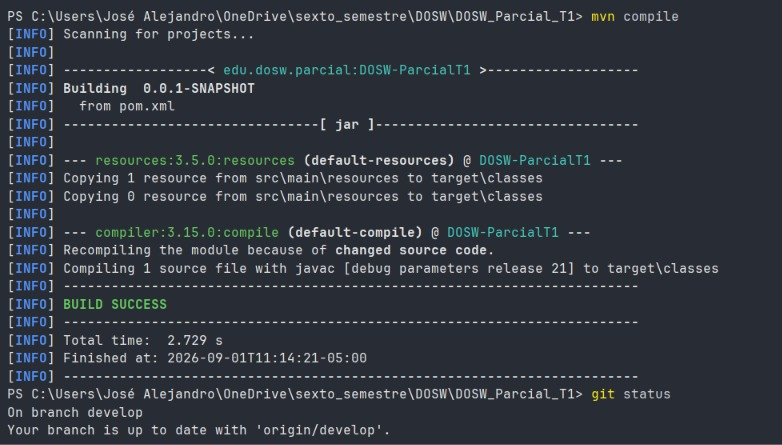

# DOSW_Parcial_T1

Carlos Andres Sanchez Jimenez
DOSW 2026-2 Grupo 1
URL BITACORA: https://github.com/Carlossj8/DOSW_BITACORA.git

## Punto 1) diagrama de contexto

## Punto 2) requerimientos

### Funcionales (3)
- Realizar pago del servicio (Uso de Adapter)
- Validar y asignar turno según disponibilidad y especialidad (Uso de Chain of Responsibility)
- Notificar motivo de rechazo de una validación

### No Funcionales (2)
- Estar disponible con un porcentaje de 99.5% en horario de operación de lunes a domingo
- El sistema debe procesar un turno en $\le \text{2 s}$ para el 95% de las solicitudes.

## Punto 3) diagrama de casos de uso

Como cliente,quiero realizar el pago de mi turno usando diferentes medios, para cancelar el valor del servicio según mi comodidad y preferencia.

Como cliente quiero Ser informado del motivo especifico de rechazo cuando una validacion falla
para poder corregir dicha información al solicitar nuevamente el servicio

## Punto 4)

## Punto 5)

## Punto 6)
### Chain of responsability
- Tipo: Comportamiento

- Justificacion: Este patron es util, ya que, necesitamos pasar solicitudes a lo largo de una cadena de barberos y, al recibir una solicitud,
  se debe decidir si este debe atender al cliente o tiene que delegarle la tarea al siguiente

- Diagrama de clases:

- SOLID: Open/Closed, ya que, al crear handlers, se garantiza que el codigo se puede extender y no es necesario modificar cada implementacion concreta al agregar otra categoria o otra funcionalidad
Dependency Inversion, ya que las dependencias estan en las abstracciones y no en los detalles de la implementacion

### Adapter

- Tipo: Estructural

- Justificacion: Este patron es util, ya que nos dicen que las 4 pasarelas de pago tienen interfaces incompatibles, de esta manera, podemos crear una clase intermedia que sirva como traductora.

- Diagrama de clases:

- SOLID: 
Open/Closed, ya que se puede introducir nuevos tipos de adaptadores al programa sin descomponer el codigo existente

SRP, ya que se puede separar la interfaz o el codigo que hace la conversion de datos de la logica de negocio

-----------------------------------------

